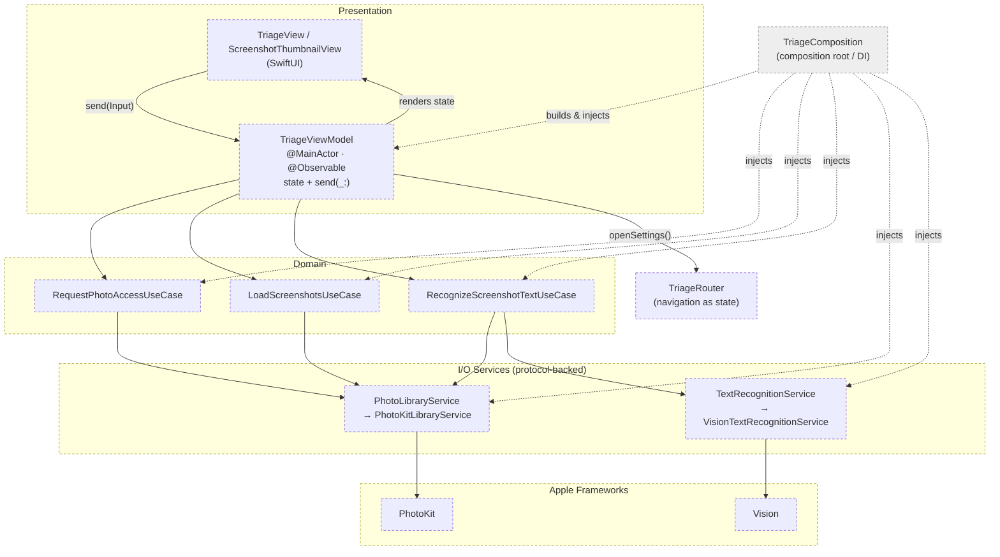

# SnapTriage

An iOS app for triaging and organizing screenshots — keep, delete, or act on them fast.

SnapTriage scans your photo library for screenshots, lays them out in a fast,
scrollable grid, and reads the text inside each one on‑device so you can quickly
decide what to do with the pile of screenshots that quietly builds up over time.

Everything runs locally on the device. No screenshots, images, or recognized
text ever leave your phone.

---

## What it does

- **Finds your screenshots automatically.** Uses PhotoKit to fetch every
  screenshot in your library (matched by media subtype, not a smart album, so it
  works on a fresh device), newest first.
- **Fast, adaptive grid.** A `LazyVGrid` of thumbnails that loads images lazily
  at the exact pixel size each cell needs, backed by a `PHCachingImageManager`.
- **On‑device text recognition (OCR).** Tap a screenshot and SnapTriage runs
  Apple's Vision text recognizer over a downscaled copy of the image, producing
  a confidence‑filtered transcript in reading order.
- **Graceful permission handling.** Clear states for *not determined*, *denied*,
  *restricted*, *limited*, and *authorized*, with a one‑tap shortcut to the
  system Settings when access is missing.

### Project status

SnapTriage is in active early development.

- **Stage 1 — Library + grid:** ✅ screenshot discovery, thumbnails, permissions.
- **Stage 2 — OCR validation:** ✅ on‑device recognition; the transcript is
  currently logged to validate OCR quality before it's persisted.
- **Stage 3 — Caching & categorization:** 🚧 planned (caching recognized text and
  categorizing screenshots build on top of Stage 2).

---

## Requirements

- **iOS 18+** — the app standardizes on the `@Observable` macro and the modern
  Vision Swift API (`RecognizeTextRequest`).
- **Xcode 16+** with a recent Swift toolchain.
- **No third‑party dependencies** — only Apple frameworks (SwiftUI, PhotoKit,
  Vision, UIKit).

---

## Getting started

```bash
git clone https://github.com/VishwaiOSDev/SnapTriage.git
cd SnapTriage
open SnapTriage.xcodeproj
```

Then select a device or simulator and run (`⌘R`). On first launch the app
requests photo‑library access; grant it to see your screenshots.

> Screenshot detection relies on real screenshots existing in the library. On
> the Simulator, add a few (e.g. `⌘S`) so the grid has something to show.

---

## Architecture & coding patterns

SnapTriage is built with a **feature‑first, lightweight unidirectional
architecture** — an MVVM core extended with explicit **UseCase** and **Service**
layers. The guiding rule is *the View renders state, the View sends intent, and
the ViewModel is the only place state mutates*.

The core ideas, in brief:

- **Unidirectional data flow.** Views render from `viewModel.state` and send
  user intent through a single `send(_:)` entry point. State is `private(set)`,
  so only the ViewModel mutates it.
- **MVVM + UseCase + Service layering.** ViewModels orchestrate; UseCases hold
  business rules; Services do I/O and pure transforms. Models are plain value
  types (`struct` / `enum`).
- **Faked at the boundaries.** System Services (`PhotoLibraryService`,
  `TextRecognitionService`) sit behind protocols, assembled by a per‑feature
  Composition root. Features never import each other.
- **`@Observable`, iOS 18+.** Views own their ViewModel via `@State`; no
  `ObservableObject`.

> The full rationale — navigation‑as‑state, cancellable async work, typed error
> mapping, domain vs UI state, and the modularization roadmap — lives in
> [`ARCHITECTURE.md`](ARCHITECTURE.md).

### Project structure

```
SnapTriage/
├── SnapTriageApp.swift          # @main entry point
├── ContentView.swift            # builds the Triage feature via its composition root
├── Common/
│   └── DesignSystem/            # Spacing, Strings (shared, framework-agnostic copy)
└── Features/
    └── Triage/
        ├── Model/               # Screenshot, OCRResult, OCRLine, TriageError, …
        ├── View/                # TriageView, ScreenshotThumbnailView
        ├── ViewModel/           # TriageViewModel (@MainActor @Observable, send(_:))
        ├── UseCase/             # RequestPhotoAccess, LoadScreenshots, RecognizeScreenshotText
        ├── Service/             # PhotoLibraryService (PhotoKit), TextRecognitionService (Vision)
        ├── Router/              # TriageRouter protocol + SystemTriageRouter
        └── Composition/         # TriageComposition — assembles the object graph
```

### High‑level architecture



**Canonical data flow:** the View renders from `state` → user taps → View calls
`send(_:)` → the ViewModel launches a tracked `Task` and sets a loading phase →
a UseCase applies business rules and calls Services → a Service performs I/O or a
pure transform → the result normalizes back through the UseCase → the ViewModel
assigns domain state and a `loaded`/`failed` phase → SwiftUI re‑renders.

---

## License

Released under the [MIT License](LICENSE). Copyright (c) 2026 Vishweshwaran Ravi.
